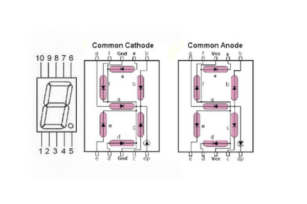
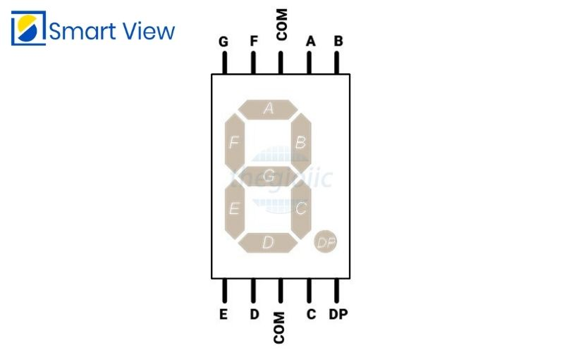

# Knowledge of 7 segment LED display
Structure and how to use: 
- [https://youtu.be/pE43y0lcFHs?si=FGoD1K3V_n8p3AQs](https://youtu.be/pE43y0lcFHs?si=FGoD1K3V_n8p3AQs)

Distinguish between common anode and common cathode: 
- [https://youtu.be/La6vUE9fkI0?si=CBWhbtPj3PkzcoBJ](https://youtu.be/La6vUE9fkI0?si=CBWhbtPj3PkzcoBJ)

# How to identify common cathode and common anode by using VOM
- Adjust the scale x10 ohm
- Place the black probe on the COM pin, the red probe on the remaining pins.
  - If the light is on => Common Anode
  - If the light is not on => It cannot be confirmed that this is a common cathode because the LED may be damaged.
    - Place the red probe on the COM pin < the black probe on the remaining pins
      - If the light is on => Common Cathode
      - If the light is not on => LED is damaged

Video demonstrating how I identify common cathode or common anode: 

