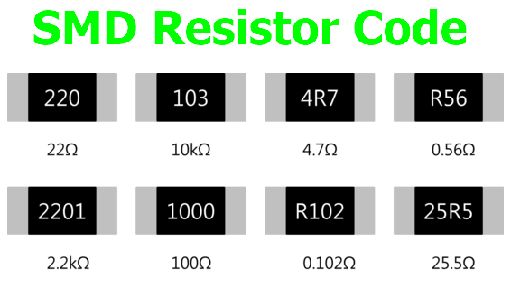
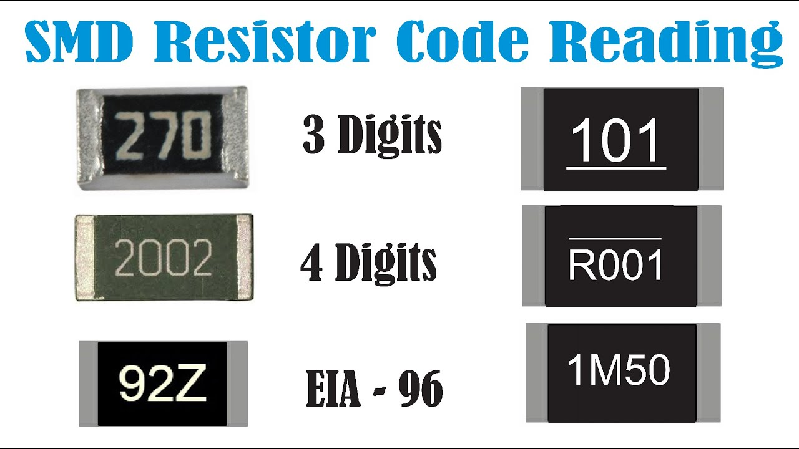

# Knowledge of Resistor

Structure and how to use: [https://youtu.be/DYcLFHgVCn0?si=4pEe-w04MNtu5Tzv](https://youtu.be/DYcLFHgVCn0?si=4pEe-w04MNtu5Tzv)

# How to read resistor color codes


 - Identify the color bands: Most through-hole resistors have 4 or 5 color bands. The first 2 (or 3) bands represent significant digits, the next band is the multiplier, and the last band shows tolerance.
- Use the color chart: Match each color to its corresponding number. For example, Black = 0, Brown = 1, Red = 2, Orange = 3, Yellow = 4, Green = 5, Blue = 6, Violet = 7, Gray = 8, White = 9.
- Calculate the resistance: Combine the significant digits and multiply by the multiplier.
- Check the tolerance: The last band tells you the possible variation in resistance, e.g., Gold = ±5%, Silver = ±10%.
  
Example: A resistor with bands Red, Violet, Yellow, Gold → 2 7 × 10,000 Ω = 270 kΩ ±5%.

# How to Read SMD Resistor Codes




Identify the code: Most SMD resistors have 3 or 4 digits printed on them, sometimes with an R to indicate a decimal point. 3- or 4-digit codes:
```
3-digit: first 2 digits = significant, last digit = multiplier (number of zeros)
Example: 472 → 47 × 10² Ω = 4.7 kΩ
```

```
4-digit: first 3 digits = significant, last digit = multiplier
Example: 1001 → 100 × 10¹ Ω = 1 kΩ
```

```
R notation for decimals: R replaces the decimal point.
Example: 4R7 → 4.7 Ω, 0R22 → 0.22 Ω
```

EIA-96 codes (2 digits + letter): Small precision resistors may use this system. Look up the number in a standard EIA-96 table, then multiply by the multiplier indicated by the letter.

Tolerance: Sometimes a letter after the number indicates tolerance, e.g., J = ±5%, K = ±10%.

# How to measure resistance by using a VOM

To measure the resistance of a component, follow these steps:

1. Disconnect the component from the circuit
 - Resistance must be measured when the component is isolated. Measuring in-circuit can produce incorrect results due to parallel paths.

2. Set the multimeter to the resistance (Ω) mode
- Select an appropriate range if your meter is not auto-ranging.
- For small resistors → choose a low range (200 Ω, 2 kΩ)
- For large resistors → choose a higher range

3. Zero the meter (optional)
- Touch the two probes together.
- The display should read close to 0 Ω.
- If not, adjust the meter (older analog meters) or note the offset.

4. Connect the probes to the resistor
- Polarity does not matter for resistance measurement.
- Place one probe on each lead of the resistor.
 
5. Read the value on the display
- The number shown is the measured resistance.
- Compare this value with the resistor’s color code or nominal value to check if it is within tolerance.

6. Interpret special cases
- If the screen shows “OL” or “∞”, the resistance is too high or the component is open.
- If the reading is much lower than expected, the component may be shorted or damaged.
- If the value slowly increases, the component might be a capacitor charging—stop and remove from the circuit.


